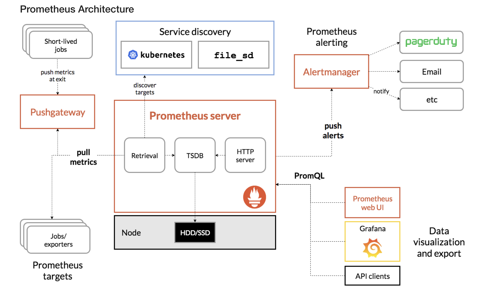

### Lý thuyết cơ bản về Prometheus

Prometheus là một hệ thống giám sát mã nguồn mở phổ biến, chuyên dùng để thu thập và lưu trữ metrics (chỉ số hệ thống).

Kiến trúc Prometheus:

- Prometheus Server: Thành phần chính, chịu trách nhiệm thu thập và lưu trữ metrics.
- Exporter: Các ứng dụng gửi metrics đến Prometheus.
- AlertManager: Xử lý cảnh báo khi metrics vượt ngưỡng.
- Client Libraries: Dùng để tích hợp Prometheus vào ứng dụng của bạn.



Cách hoạt động:
- Prometheus scrapes metrics từ các endpoint HTTP (REST API).
- Metrics được lưu trong cơ sở dữ liệu dạng time-series.
- Người dùng sử dụng PromQL để truy vấn dữ liệu.
- Tạo cảnh báo qua AlertManager khi cần.
  
### Cấu hình thực tế với hệ thống nhiều service hoặc microservices
Trên một hệ thống microservices với nhiều dịch vụ, việc quản lý Prometheus phụ thuộc vào quy mô, độ phức tạp, và yêu cầu giám sát của hệ thống. Thông thường, có hai cách phổ biến để triển khai Prometheus:

---

#### 1. Dùng một Prometheus duy nhất cho toàn hệ thống
##### Cách triển khai:
- **Một Prometheus instance:** Tất cả các service được cấu hình trong một tệp `prometheus.yml`.  
- Prometheus thu thập dữ liệu từ tất cả các service thông qua các `scrape_configs`.

##### Ưu điểm:
1. **Quản lý tập trung:**
   - Tất cả dữ liệu từ các service nằm trong một nơi duy nhất, dễ dàng truy vấn và phân tích.
   - Giảm chi phí vận hành khi chỉ cần duy trì một instance Prometheus.

2. **Dễ tích hợp với Grafana:**
   - Một datasource duy nhất giúp cấu hình các dashboard trong Grafana trở nên đơn giản.

3. **Tiết kiệm tài nguyên:**
   - Chỉ cần một Prometheus instance thay vì triển khai nhiều instance.

##### Nhược điểm:
1. **Giới hạn về hiệu năng:**
   - Nếu hệ thống lớn, số lượng service và metric tăng cao, Prometheus có thể trở thành **bottleneck**.
   - Lượng dữ liệu lưu trữ lớn làm tăng chi phí bộ nhớ và hiệu suất query giảm.

2. **Khả năng mở rộng khó:**
   - Một instance Prometheus khó mở rộng khi hệ thống phát triển.

##### Ví dụ cấu hình:
```yaml
scrape_configs:
  - job_name: 'service1'
    static_configs:
      - targets: ['service1:8080']
  - job_name: 'service2'
    static_configs:
      - targets: ['service2:8080']
  - job_name: 'node-exporter'
    static_configs:
      - targets: ['node-exporter:9100']
```

---

#### 2. Dùng nhiều Prometheus (mỗi service một Prometheus riêng hoặc chia theo nhóm)
##### Cách triển khai:
- **Nhiều instance Prometheus**, mỗi instance giám sát một nhóm dịch vụ hoặc một service cụ thể.  
- **Prometheus Federation:** Một Prometheus cấp cao hơn (federation Prometheus) tổng hợp dữ liệu từ các Prometheus con.

##### Ưu điểm:
1. **Tăng khả năng mở rộng:**
   - Dữ liệu từ từng service được thu thập riêng biệt, giảm tải cho từng Prometheus instance.

2. **Giảm nguy cơ mất dữ liệu:**
   - Nếu một instance Prometheus gặp sự cố, các instance khác vẫn hoạt động bình thường.

3. **Phân quyền rõ ràng:**
   - Mỗi nhóm phát triển có thể quản lý Prometheus riêng cho service của họ mà không ảnh hưởng đến các nhóm khác.

##### Nhược điểm:
1. **Quản lý phức tạp hơn:**
   - Phải duy trì nhiều instance Prometheus, cần cài đặt, cấu hình và giám sát riêng từng instance.

2. **Chi phí tài nguyên cao hơn:**
   - Mỗi instance Prometheus yêu cầu tài nguyên riêng cho bộ nhớ, lưu trữ và xử lý.

##### Cấu hình Federation:
Prometheus cấp cao hơn sẽ lấy dữ liệu từ các Prometheus con thông qua `federate` endpoint:
```yaml
scrape_configs:
  - job_name: 'prometheus_child'
    metrics_path: '/federate'
    params:
      match[]:
        - '{job="service1"}'
        - '{job="service2"}'
    static_configs:
      - targets:
          - 'prometheus-service1:9090'
          - 'prometheus-service2:9090'
```

---

#### 3. Lựa chọn nào phù hợp?

##### Khi nên dùng một Prometheus duy nhất:
- Hệ thống nhỏ hoặc vừa, chỉ có vài microservices.
- Yêu cầu giám sát không quá phức tạp.
- Tài nguyên hạn chế, ưu tiên tối ưu hóa chi phí vận hành.

##### Khi nên dùng nhiều Prometheus:
- Hệ thống lớn, có hàng chục hoặc hàng trăm service.
- Cần khả năng mở rộng và tránh **bottleneck**.
- Dữ liệu nhạy cảm hoặc có yêu cầu phân quyền nghiêm ngặt giữa các nhóm.
- Phân tán nhiều khu vực địa lý hoặc trên nhiều cụm Kubernetes.

---

#### 4. Thực tế triển khai
1. **Triển khai trên Kubernetes:**
   - Mỗi namespace có một Prometheus riêng để giám sát các service trong namespace đó.
   - Sử dụng **Prometheus Operator** để dễ dàng quản lý các instance Prometheus.

2. **Tích hợp với Grafana:**
   - Tạo datasource từ từng Prometheus instance hoặc chỉ từ Prometheus federation.

3. **Kết hợp Prometheus và Thanos:**
   - **Thanos** là một giải pháp mở rộng Prometheus, cung cấp:
     - Khả năng lưu trữ dài hạn.
     - Hợp nhất dữ liệu từ nhiều Prometheus instance.
     - Query phân tán trên nhiều Prometheus.
   - Sư dụng với hệ thống lớn với hàng trăm namespace.
   - Dữ liệu giám sát cần lưu trữ lâu dài (>30 ngày).
   - Yêu cầu khả năng query phân tán trên nhiều Prometheus.

4. **Cách triển khai Prometheus và Thanos:**
- Thanos hoặc Cortex hoạt động như tầng lưu trữ bên ngoài và query aggregator:
  - **Thanos Sidecar:** Mỗi Prometheus instance kèm theo một Thanos Sidecar để gửi dữ liệu lên tầng lưu trữ dài hạn (S3, GCS,...).
  - **Thanos Query:** Cung cấp khả năng tổng hợp dữ liệu từ nhiều Prometheus.

---

### **Tóm tắt lựa chọn quản lý Prometheus trong Kubernetes**
| Mô hình                         | Ưu điểm                               | Nhược điểm                      | Khi nào nên dùng                             |
| ------------------------------- | ------------------------------------- | ------------------------------- | -------------------------------------------- |
| **Một Prometheus toàn cluster** | Đơn giản, tiết kiệm tài nguyên        | Khó mở rộng, RBAC phức tạp      | Hệ thống nhỏ đến vừa                         |
| **Một Prometheus/namespace**    | Phân quyền rõ ràng, độc lập           | Tổng hợp dữ liệu phức tạp       | Hệ thống vừa với nhiều nhóm độc lập          |
| **Federation**                  | Mở rộng tốt, tổng hợp dữ liệu dễ dàng | Phức tạp hơn                    | Hệ thống lớn, yêu cầu phân tích toàn cluster |
| **Thanos/Cortex**               | Lưu trữ dài hạn, mở rộng vô hạn       | Triển khai và vận hành phức tạp | Hệ thống rất lớn, cần lưu trữ lâu dài        |

