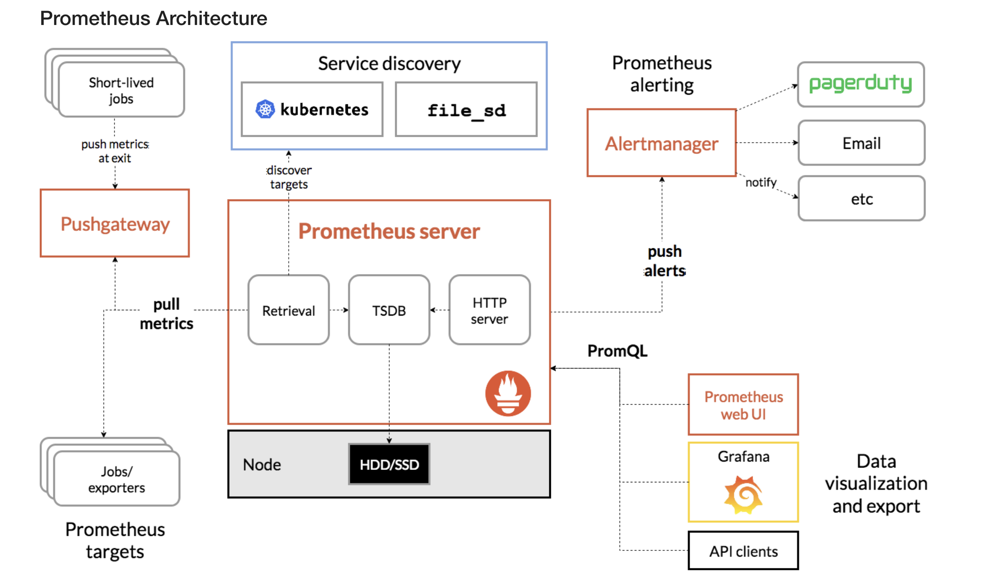

### Lý thuyết cơ bản về Prometheus

Prometheus là một hệ thống giám sát mã nguồn mở phổ biến, chuyên dùng để thu thập và lưu trữ metrics (chỉ số hệ thống).

Kiến trúc Prometheus:

- Prometheus Server: Thành phần chính, chịu trách nhiệm thu thập và lưu trữ metrics.
- Exporter: Các ứng dụng gửi metrics đến Prometheus.
- AlertManager: Xử lý cảnh báo khi metrics vượt ngưỡng.
- Client Libraries: Dùng để tích hợp Prometheus vào ứng dụng của bạn.

Cách hoạt động:
- Prometheus scrapes metrics từ các endpoint HTTP (REST API).
- Metrics được lưu trong cơ sở dữ liệu dạng time-series.
- Người dùng sử dụng PromQL để truy vấn dữ liệu.
- Tạo cảnh báo qua AlertManager khi cần.